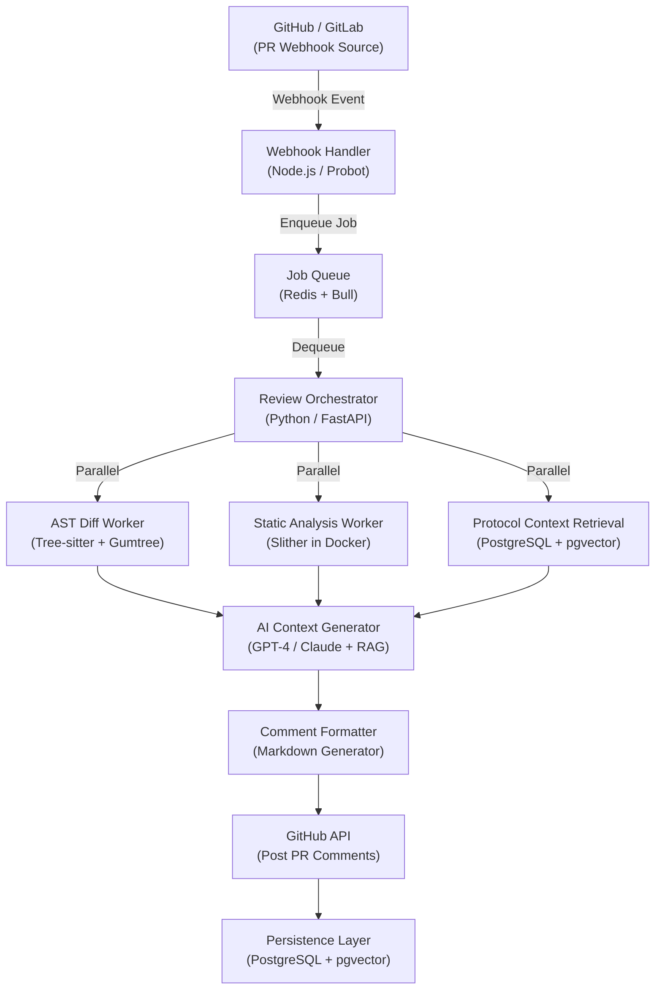

# WSDC — Web3 Security Development Co-Pilot

<aside>
🛡️

**AI-Powered PR Security Reviewer for DeFi & Web3**

Unlike static scanners, WSDC builds a *persistent understanding* of each protocol's trust model, tracks security posture evolution across commits, and shapes developer behavior through contextual, educational feedback.

</aside>

| **Version** | **Status** | **Owner** | **Target Launch** | **Last Updated** |
| --- | --- | --- | --- | --- |
| 1.0 | Pre-Development | Rishabh Raj Singh | June 1, 2026 | February 4, 2026 |

---

## 1. Executive Summary

### 1.1 Product Vision

WSDC is an **AI-powered security reviewer** that embeds directly into the Web3 development lifecycle via **GitHub/GitLab PR workflows**. It acts as an always-on, context-aware security teammate that reviews every pull request for smart contract vulnerabilities — not by scanning entire codebases blindly, but by understanding *what changed*, *why it matters for this specific protocol*, and *how to fix it*.

### 1.2 The One-Liner

> **"Continuous, protocol-aware security review for every PR — so exploits are caught before they're merged, not after they're deployed."**
> 

### 1.3 Core Differentiators

| **Capability** | **What It Means** | **Why It Matters** |
| --- | --- | --- |
| 🧠 **Stateful** | Remembers protocol architecture, past fixes, and acknowledged risks | No more re-explaining your codebase to a tool every time |
| 🔀 **Diff-Aware** | Reviews *what changed*, not the entire codebase | Dramatically fewer false positives — devs actually read the output |
| 📚 **Educational** | Teaches secure patterns with protocol-specific context | Devs level up over time; security culture compounds |
| ⛓️ **Protocol-Native** | Understands economic invariants, governance risks, oracle dependencies | Catches DeFi-specific bugs that generic tools miss entirely |

### 1.4 Target Market

**Primary:** DeFi protocols, DAOs, and Web3 infrastructure projects.

**Initial Focus:** EVM-compatible chains — Ethereum, Polygon, Arbitrum, Base.

### 1.5 Success Metrics (12-Month Targets)

| **Metric** | **Target** | **How We Measure** |
| --- | --- | --- |
| Active protocols | 100 | Repos with 10+ PRs reviewed |
| Security issues prevented | 500+ | Findings marked as "fixed" before merge |
| Audit finding reduction | 15% | Before/after comparison for paying customers |
| ARR | $500K | Stripe MRR × 12 |

---

## 2. Problem Statement

### 2.1 The Core Problem

Web3 security is fundamentally broken at the development level. **Bugs are found too late, tools are too noisy, and security knowledge doesn't compound.**

### 2.2 Developer Pain Points

<aside>
👨‍💻

**The Developer Experience Today**

</aside>

1. **False positive overload** — Static tools like Slither and Mythril produce alerts without protocol context, leading to alert fatigue and ignored warnings
2. **Audit findings arrive too late** — Months of insecure code accumulate before an auditor sees them. By then, fixes are expensive and risky
3. **No educational feedback** — Junior devs are told *what's* wrong, never *why* a pattern is insecure or *how* it could be exploited in their specific protocol
4. **Zero visibility into cumulative risk** — No way to see how a single PR shifts the protocol's overall attack surface

### 2.3 Security Team Pain Points

<aside>
🔐

**The Security Lead Experience Today**

</aside>

1. **Manual PR review doesn't scale** — A human can't review every PR across multiple repos with the depth required
2. **Repeated vulnerability patterns** — The same class of bug shows up across PRs because there's no institutional memory
3. **No standardized knowledge capture** — Security insights live in auditors' heads, not in the codebase
4. **Upgrade safety is a black box** — Proxy upgrade impact analysis is manual, error-prone, and often skipped

### 2.4 The Market Gap

<aside>
💡

Tools detect bugs. Audits are one-time snapshots. **There is no continuous security reviewer that learns your protocol.**

WSDC fills this gap.

</aside>

---

## 3. User Personas

### 3.1 Primary: Protocol Engineer ("Alex")

| **Role** | Full-stack Web3 developer at a mid-size DeFi protocol |
| --- | --- |
| **Experience** | 2–3 years Solidity, previously a Web2 backend engineer |
| **Daily Behavior** | Opens 1–2 PRs/day, reviews 3–5 PRs from teammates, checks CI status religiously |
| **Core Pain** | Ships features fast but gets flagged hard in quarterly audits — feels blindsided |
| **Goal** | Ship features confidently without introducing critical vulnerabilities |
| **Tool Attitude** | Will ignore anything that's noisy. Needs signal, not noise |
| **WSDC Value** | Catches issues *in the PR*, explains *why* it matters for this protocol, suggests fixes inline |

### 3.2 Secondary: Security Lead ("Sam")

| **Role** | Head of Security at a top-50 DeFi protocol |
| --- | --- |
| **Experience** | 5+ years auditing smart contracts, ex-Trail of Bits / OpenZeppelin |
| **Daily Behavior** | Reviews only critical PRs, relies on team to self-serve on lower severity issues |
| **Core Pain** | Can't review every PR — team keeps making the same mistakes |
| **Goal** | Reduce audit costs, prevent exploits, get executive-level security metrics |
| **Tool Attitude** | Wants dashboards, trend lines, and proof of improvement |
| **WSDC Value** | Security posture dashboard, regression detection, attack surface tracking per PR |

### 3.3 Tertiary: Junior Developer ("Jordan")

| **Role** | New Web3 developer, 6 months into first Solidity role |
| --- | --- |
| **Experience** | Strong JavaScript/Python background, learning Solidity on the job |
| **Daily Behavior** | Relies heavily on AI tools, reads docs, asks teammates lots of questions |
| **Core Pain** | Doesn't know secure Solidity patterns — learns by making mistakes in production code |
| **Goal** | Learn Web3 security best practices on the job without slowing the team down |
| **WSDC Value** | Educational explanations, exploit scenarios, suggested test cases — an always-on mentor |

---

## 4. Core Features

### Phase 1: MVP — Months 1–3

<aside>
🚀

**Goal:** Ship a working GitHub PR reviewer that catches real Solidity bugs with protocol-aware AI explanations.

</aside>

---

#### 4.1 GitHub App PR Integration

**User Story:** *As Alex, I want automated security review on every PR so I catch issues before requesting human review.*

**Functionality:**

- GitHub App installation via OAuth flow
- Webhook listeners for `pull_request.opened` and `pull_request.synchronize` events
- Repository cloning into a sandboxed execution environment
- **Line-specific inline comments** on diffs (not just PR-level summaries)
- PR summary comment showing the **security delta** (what changed from a risk perspective)

**Technical Requirements:**

- GitHub App permissions: `pull_requests: write`, `contents: read`, `issues: write`
- Secure secret storage for GitHub private keys and webhook secrets
- Rate limit handling: 5,000 API calls/hour per installation
- Webhook signature validation (HMAC-SHA256)

---

#### 4.2 Solidity Diff Analysis

**User Story:** *As the system, I need to understand semantic changes in Solidity code to trigger only relevant security checks.*

**Functionality:**

- **AST-based diff** using Tree-sitter + Gumtree (not line-based — understands code structure)
- Identifies security-relevant changes:
    - New external calls introduced
    - State variable modifications
    - Access control changes (modifiers added/removed, `require` statements)
    - Storage layout changes (critical for upgradeable contracts)
- Filters out unchanged files/functions from analysis entirely

**Technical Requirements:**

- Tree-sitter with `tree-sitter-solidity` parser
- Custom AST diff algorithm mapping old → new nodes
- Change classification taxonomy: `external_call_added`, `state_mutation_order_changed`, `role_check_removed`, etc.

---

#### 4.3 Static Analysis Engine

**User Story:** *As WSDC, I need to detect known vulnerability patterns to flag risky changes with high confidence.*

**Functionality:**

- **Slither integration** via Python subprocess — 70+ built-in detectors
- Custom checks for the **Top 10 Solidity Vulnerabilities:**

| **#** | **Vulnerability** | **Detection Method** |
| --- | --- | --- |
| 1 | Reentrancy (CEI violations) | Call graph + state mutation ordering |
| 2 | Integer overflow/underflow | Unchecked math block detection |
| 3 | Unchecked external calls | Return value analysis |
| 4 | Missing/broken access control | Modifier + require pattern matching |
| 5 | Uninitialized storage pointers | Storage layout analysis |
| 6 | Delegatecall to untrusted contracts | Target address source tracking |
| 7 | `tx.origin` authentication | Pattern matching |
| 8 | Block timestamp manipulation | Timestamp dependency analysis |
| 9 | DoS via gas limits | Loop + external call analysis |
| 10 | Front-running risks | State-dependent transaction ordering |
- **Diff-filtered findings only** — only report issues in changed or affected lines

**Technical Requirements:**

- Docker container with Slither + `solc` versions 0.6–0.8
- JSON output parsing with line number mapping (Slither output → GitHub PR line numbers)

---

#### 4.4 AI Context Layer

**User Story:** *As Alex, I want explanations tailored to MY protocol, not generic OWASP boilerplate.*

**Functionality:**

- **LLM prompt chain:**
    1. **Input:** Code diff + Slither findings + surrounding file context
    2. **Retrieval:** Protocol model (contract roles, trust edges, known risks)
    3. **Generation:** Why this matters *here* + exploit scenario + fix options
- OWASP mapping (Smart Contract Top 10 + ASVS where applicable)
- **Educational framing** — teaches the secure pattern, doesn't just say "fix this"

**Technical Requirements:**

- OpenAI GPT-4 Turbo or Anthropic Claude 3.5 Sonnet API
- **RAG system:** `pgvector` store in PostgreSQL for protocol context embeddings
- Prompt templates with few-shot examples per vulnerability category
- Token budget management: limit context to 8K tokens/request for cost control

---

#### 4.5 Tiered PR Comments

**User Story:** *As Alex, I want scannable comments that I can expand for detail — not walls of text.*

**Functionality:**

- **3-level collapsible format:**
    - **Level 1 (Glanceable):** One-line summary + severity badge
    - **Level 2 (Contextual):** Protocol-specific explanation + exploit scenario
    - **Level 3 (Deep Dive):** Full code fix options with tradeoffs + OWASP mapping
- Interactive bot commands:
    - `/wsdc accept-risk` — Acknowledge and suppress a finding
    - `/wsdc explain` — Get a deeper explanation of a finding
    - `/wsdc suggest-test` — Generate a Foundry test for the finding
- PR summary comment with **attack surface delta table**

**Technical Requirements:**

- GitHub Markdown rendering with `<details>/<summary>` tags
- Comment threading to group related findings
- Bot user mention handling for interactive commands

---

### Phase 2: Protocol Intelligence — Months 4–6

<aside>
🧠

**Goal:** Build persistent protocol memory so WSDC gets smarter with every PR it reviews.

</aside>

---

#### 4.6 Protocol Model Builder

**User Story:** *As WSDC, I need to understand the trust boundaries of this protocol to give truly contextual advice.*

**Functionality:**

- **Automated extraction** on first install:
    - Contract inheritance tree
    - Role-based access control (Ownable, AccessControl roles)
    - Upgradeable proxy patterns (TransparentProxy, UUPS)
    - External dependencies (token contracts, oracles, routers)
- **Manual annotation** via config file (`.wsdc/protocol.yaml`):

```yaml
trusted_contracts:
  - PriceOracle: centralized, 2/3 multisig
invariants:
  - "total_deposits >= total_withdrawals"
critical_paths:
  - withdraw_flow: [RequestWithdraw, ProcessWithdraw, TransferAssets]
```

**Technical Requirements:**

- Solidity import graph analysis
- OpenZeppelin contract detection (Ownable, Pausable, ReentrancyGuard, etc.)
- Config schema validation with helpful error messages
- Storage: PostgreSQL with JSONB for flexible protocol metadata

---

#### 4.7 Security History Tracking

**User Story:** *As Sam, I want to see if this team keeps making the same mistakes.*

**Functionality:**

- Persistent database of **all findings per repo**: timestamp, PR number, file, line, category, resolution (fixed / accepted risk / false positive)
- **Regression detection:** "This reentrancy pattern was fixed in PR #142 — it's back in this PR"
- **Trend analysis:** "Unchecked external calls appeared 3× in the last 2 weeks"

**Technical Requirements:**

- Time-series storage in PostgreSQL (indexed on `repo_id`, `category`, `timestamp`)
- Deduplication logic (same line flagged across multiple PRs = 1 entry)
- Resolution tracking via bot commands or PR merge status

---

#### 4.8 Attack Surface Diffing

**User Story:** *As Sam, I want a quantified risk delta for every PR — not just a list of findings.*

**Functionality:**

- **Metrics tracked per PR:**
    - External calls added/removed
    - Privileged functions added
    - Storage layout changes
    - New token/oracle dependencies
- **Risk scoring:** Baseline (initial scan) → Delta per PR
- **Visualization:** "Attack surface +12% (2 new external calls, 1 new owner function)"

**Technical Requirements:**

- Metrics calculation engine
- Baseline snapshot storage per repo
- Delta computation (current state − baseline)

---

#### 4.9 Interactive Fix Application

**User Story:** *As Alex, I want to apply suggested fixes with one click — not copy-paste from comments.*

**Functionality:**

- GitHub **suggestion blocks** (developer clicks "Commit suggestion" directly in the PR)
- Multi-line suggestions for complex refactors
- Preview diff before applying

**Technical Requirements:**

- GitHub Suggestions API integration
- Code generation with AST manipulation (preserves formatting and style)

---

### Phase 3: Ecosystem Integration — Months 7–9

<aside>
🌐

**Goal:** Become the default security layer in the Web3 CI/CD pipeline.

</aside>

---

#### 4.10 Test Generation

**User Story:** *As Jordan, I want auto-generated test cases for the vulnerabilities I just fixed.*

**Functionality:**

- Generate **Foundry invariant tests** for each detected issue
- Example: Reentrancy finding → generates a test with a malicious contract performing a callback attack
- Delivered as a separate PR comment or file suggestion

**Technical Requirements:**

- Foundry test templates per vulnerability category
- LLM-based test generation using specific vulnerability context + protocol model

---

#### 4.11 CI/CD Integration

**User Story:** *As Sam, I want to block merges if critical security issues are unresolved.*

**Functionality:**

- GitHub Actions **status check** integration
- Configurable severity thresholds: "Block on Critical, warn on High"
- Override command: `/wsdc approve-merge "reason"` (logged for audit trail)

**Technical Requirements:**

- GitHub Checks API integration
- Webhook handling for check status updates
- Configuration stored in `.wsdc/protocol.yaml`

---

#### 4.12 Dashboard & Analytics

**User Story:** *As Sam, I want executive-level metrics on protocol security posture.*

**Functionality:**

- **Web dashboard** (Next.js):
    - Security score trend over time
    - Top vulnerability categories (heatmap)
    - Mean time to resolution
    - Acknowledged risks register
- **Export reports** (PDF) for audit prep and board reporting

**Technical Requirements:**

- Next.js 14 (App Router) frontend + Supabase Auth (GitHub OAuth)
- Read-only API endpoints from PostgreSQL
- Charting with Recharts or Tremor
- Hosted on Vercel

---

## 5. Technical Architecture

### 5.1 System Overview



### 5.2 Data Flow — Per PR Review

<aside>
⏱️

**Total review time: 15–30 seconds per PR** — fast enough for background review without blocking developer flow.

</aside>

▶##### Step 1: Webhook Receipt (< 100ms)

- GitHub sends `pull_request.opened` event
- Node.js server validates HMAC-SHA256 signature
- Extracts: `repo_id`, `pr_number`, `head_sha`, `base_sha`, `changed_files[]`
- Enqueues to Redis: `{job_id, priority, repo_id, pr_number}`

▶##### Step 2: Repo Cloning (2–5s)

- Worker pulls job from queue
- Clones repo to ephemeral container (Google Cloud Run sandbox)
- Checks out PR branch: `git checkout $head_sha`
- Generates diff: `git diff $base_sha $head_sha -- '*.sol'`

▶##### Step 3: AST Diff Analysis (1–3s per file)

- Parses old and new versions with Tree-sitter
- Runs Gumtree diff algorithm
- Outputs edit script: `[{type: 'insert', node: 'ExternalCall', line: 156}, ...]`
- Classifies changes: `external_call_added`, `state_var_modified`, etc.

▶##### Step 4: Static Analysis (5–15s)

- Spins up Slither Docker container
- Runs: `slither . --json output.json`
- Parses JSON findings
- Filters by diff: only reports issues in changed lines

▶##### Step 5: Protocol Context Retrieval (500ms)

- Queries PostgreSQL: `SELECT * FROM protocol_models WHERE repo_id = $1`
- Fetches: contract roles, trust edges, past findings
- Vector search in `pgvector`: finds similar past issues for RAG context

▶##### Step 6: AI Comment Generation (3–5s per finding)

- Constructs prompt with diff + findings + protocol context
- LLM generates: one-line summary → protocol-specific context → exploit scenario → fix options → OWASP mapping
- Parses response into structured JSON → renders tiered Markdown comment

▶##### Step 7: Comment Posting (1–2s)

- Posts inline comments at specific line numbers via GitHub API
- Posts PR-level summary comment with attack surface delta

▶##### Step 8: Persistence (async)

- Saves findings to PostgreSQL
- Updates attack surface metrics
- Stores protocol model changes
- Updates security history for regression tracking

---

## 6. Technology Stack

### 6.1 Backend Services

| **Component** | **Technology** | **Rationale** |
| --- | --- | --- |
| Primary language | Python 3.11 | Best Slither integration, rich AI/ML ecosystem |
| Secondary language | Node.js / TypeScript | Best GitHub API client libraries, webhook handling |
| API framework | FastAPI (Python) | Async-first, auto-docs, high performance |
| GitHub App framework | Probot (Node.js) | Official GitHub framework, handles auth/webhooks out of the box |
| Job queue | Redis + Bull (Node.js) / Celery (Python) | Priority queue support, reliable retry, dead letter queues |
| Primary database | PostgreSQL 15 | Relational data (protocols, findings, history) + JSONB for flexibility |
| Vector store | `pgvector` | Native Postgres extension for RAG — no additional infra overhead |
| Cache / sessions | Redis | Fast caching, session storage, pub/sub |

### 6.2 Analysis Tools

| **Component** | **Technology** | **Rationale** |
| --- | --- | --- |
| Solidity parsing | Tree-sitter + tree-sitter-solidity | Fast, incremental parsing with full AST access |
| AST diffing | Gumtree | State-of-the-art tree differencing algorithm |
| Static analysis (primary) | Slither | 70+ detectors, Python-native, industry standard |
| Static analysis (optional) | Mythril | Symbolic execution for complex issues |
| Compiler | solc 0.6–0.8 | AST generation, multi-version support |
| LLM (primary) | OpenAI GPT-4 Turbo | Best reasoning for security analysis |
| LLM (backup) | Anthropic Claude 3.5 Sonnet | Comparison + fallback |
| LLM orchestration | LangChain | Prompt templating, RAG pipeline, tool chaining |

### 6.3 Infrastructure

| **Component** | **Technology** | **Rationale** |
| --- | --- | --- |
| Compute | Google Cloud Run | Serverless containers, auto-scaling, sandboxed, pay-per-use |
| Container isolation | gVisor + Docker | Additional sandboxing for untrusted code execution |
| CI/CD | GitHub Actions | Native integration, deployment + testing |
| Container registry | Docker Hub | Public + private image hosting |
| Error tracking | Sentry | Real-time error monitoring with context |
| Metrics | Grafana + Prometheus | Review latency, job queue depth, system health |
| Product analytics | PostHog | Feature usage, conversion funnels, retention |

### 6.4 Frontend (Dashboard)

| **Component** | **Technology** |
| --- | --- |
| Framework | Next.js 14 (App Router) |
| UI library | Shadcn/ui + Tailwind CSS |
| Auth | Supabase Auth (GitHub OAuth) |
| Hosting | Vercel |
| Charts | Recharts or Tremor |

---

## 7. Data Models

### 7.1 PostgreSQL Schema

```sql
-- ============================================
-- WSDC Database Schema
-- ============================================

-- Repositories: Tracks installed GitHub repos
CREATE TABLE repositories (
    id UUID PRIMARY KEY,
    github_id BIGINT UNIQUE NOT NULL,
    owner TEXT NOT NULL,
    name TEXT NOT NULL,
    installation_id BIGINT NOT NULL,
    installed_at TIMESTAMP DEFAULT NOW(),
    config JSONB,          -- .wsdc/protocol.yaml contents
    metadata JSONB
);

-- Protocol Models: Trust boundaries + architecture per repo
CREATE TABLE protocol_models (
    id UUID PRIMARY KEY,
    repo_id UUID REFERENCES repositories(id),
    contracts JSONB NOT NULL,    -- [{name, path, roles: []}]
    trust_edges JSONB,           -- [{from, to, trust_level, reason}]
    invariants TEXT[],
    created_at TIMESTAMP DEFAULT NOW(),
    updated_at TIMESTAMP DEFAULT NOW()
);

-- Pull Requests: Tracks every reviewed PR
CREATE TABLE pull_requests (
    id UUID PRIMARY KEY,
    repo_id UUID REFERENCES repositories(id),
    pr_number INT NOT NULL,
    head_sha TEXT NOT NULL,
    base_sha TEXT NOT NULL,
    status TEXT,                  -- 'pending', 'reviewed', 'failed'
    attack_surface_delta JSONB,  -- {external_calls: +2, ...}
    reviewed_at TIMESTAMP,
    UNIQUE(repo_id, pr_number)
);

-- Findings: Every security issue detected
CREATE TABLE findings (
    id UUID PRIMARY KEY,
    pr_id UUID REFERENCES pull_requests(id),
    category TEXT NOT NULL,        -- 'reentrancy', 'access_control', etc.
    severity TEXT NOT NULL,        -- 'critical', 'high', 'medium', 'low'
    file_path TEXT NOT NULL,
    line_number INT,
    title TEXT NOT NULL,
    description TEXT,
    exploit_scenario TEXT,
    fix_suggestions JSONB,         -- [{option, code, tradeoff}]
    owasp_mapping TEXT[],          -- ['SC-05', 'A01']
    status TEXT,                   -- 'open', 'fixed', 'accepted_risk', 'false_positive'
    resolution_comment TEXT,
    github_comment_id BIGINT,
    created_at TIMESTAMP DEFAULT NOW()
);

-- Security History: Aggregated patterns per repo
CREATE TABLE security_history (
    id UUID PRIMARY KEY,
    repo_id UUID REFERENCES repositories(id),
    category TEXT NOT NULL,
    occurrences INT DEFAULT 1,
    last_seen_pr_id UUID REFERENCES pull_requests(id),
    first_seen_at TIMESTAMP DEFAULT NOW(),
    last_seen_at TIMESTAMP DEFAULT NOW()
);

-- Indexes for common queries
CREATE INDEX idx_findings_pr ON findings(pr_id);
CREATE INDEX idx_findings_category ON findings(category);
CREATE INDEX idx_findings_status ON findings(status);
CREATE INDEX idx_history_repo_category ON security_history(repo_id, category);
```

### 7.2 pgvector Schema (Vector Store)

```python
# Protocol context embeddings for RAG
protocol_contexts = {
    "id": "uuid",
    "repo_id": "uuid",
    "content_type": "string",      # 'contract', 'finding', 'fix'
    "content": "string",           # The actual text content
    "embedding": "vector(1536)",   # OpenAI text-embedding-3-small
    "metadata": "json"             # {file, line, timestamp}
}
```

---

## 8. API Specifications

### 8.1 Webhook Endpoints

▶##### POST `/webhooks/github`

- **Purpose:** Receive GitHub webhook events
- **Auth:** HMAC-SHA256 signature validation
- **Payload:** GitHub webhook JSON
- **Response:** `202 Accepted` (job queued)

### 8.2 Internal APIs

▶##### POST `/api/reviews/trigger`

**Request:**

```json
{
  "repo_id": "uuid",
  "pr_number": 123,
  "head_sha": "abc123",
  "base_sha": "def456"
}
```

**Response:** `{job_id, status}`

▶##### GET `/api/reviews/{job_id}`

**Response:**

```json
{
  "job_id": "uuid",
  "status": "completed",
  "findings_count": 5,
  "pr_comment_url": "https://github.com/..."
}
```

### 8.3 Dashboard APIs

▶##### GET `/api/repos/{repo_id}/metrics`

**Response:**

```json
{
  "security_score": 87,
  "trend": "+3 (last 7 days)",
  "total_findings": 142,
  "resolved": 138,
  "open_critical": 1,
  "attack_surface_history": [
    {"date": "2026-01-01", "score": 84},
    {"date": "2026-01-08", "score": 87}
  ]
}
```

---

## 9. Configuration

### 9.1 Repository Config — `.wsdc/protocol.yaml`

```yaml
version: 1.0

protocol:
  name: "DeFi Vault Protocol"
  type: "lending"  # Options: lending, dex, bridge, governance

trust_model:
  oracles:
    - address: "0x123..."
      type: "Chainlink"
      trust_level: "high"
  governance: "DAO"
  multisigs:
    - address: "0xabc..."
      threshold: "2/3"
      controls: ["upgrade_proxy", "emergency_pause"]

invariants:
  - "totalDeposits >= totalWithdrawals"
  - "collateralRatio >= 150%"

critical_paths:
  - name: "withdraw_flow"
    contracts: ["VaultCore", "AssetManager", "RewardDistributor"]

security_settings:
  severity_threshold: "high"       # Block PRs on high+ severity
  auto_approve_low: false
  require_tests_for_fixes: true
  excluded_patterns:
    - "test/**"
    - "scripts/**"
```

---

## 10. Development Roadmap

| **Sprint** | **Weeks** | **Phase** | **Deliverables** |
| --- | --- | --- | --- |
| 1–2 | 1–4 | 🏗️ Foundation | GitHub App registration, OAuth flow, webhook handler, job queue, repo cloning + sandboxing (Cloud Run), basic PR comment posting |
| 3–4 | 5–8 | 🔬 Analysis Engine | Tree-sitter Solidity parser, AST diff algorithm (Gumtree), Slither Docker container + API, diff-filtered finding generation |
| 5–6 | 9–12 | 🤖 AI Layer | `pgvector` setup + embedding pipeline, GPT-4 prompt templates (tiered comments), protocol model extraction (auto + manual config), OWASP mapping |
| 7–8 | 13–16 | ✨ Product Polish | Interactive commands (`/wsdc accept-risk`, etc.), attack surface diffing, security history tracking, regression detection |
| 9–10 | 17–20 | 🚀 Beta Launch | Next.js dashboard, user onboarding flow, documentation site, pilot with 5 protocols |
| 11–12 | 21–24 | 💰 Scale | CI/CD integration (GitHub Actions checks), Foundry test generation, pricing tiers + Stripe, marketing push (Product Hunt) |

---

## 11. Go-to-Market Strategy

### 11.1 Phase 1 — Community Seeding (Months 1–3)

- **Community beta:** Offer free access to all hackathon teams and early Web3 builder communities
- **Capture case studies:** "Prevented X critical bugs in Y protocol" — real stories, real numbers
- **Content marketing:**
    - Blog: *"10 Reentrancy Bugs Caught by WSDC Before They Hit Mainnet"*
    - YouTube demo: *"AI Security Reviewer vs. Manual Audit — Side by Side"*

### 11.2 Phase 2 — Freemium Growth (Months 4–9)

| **Tier** | **Price** | **Includes** |
| --- | --- | --- |
| 🆓 Free | $0/month | 1 repo, 20 PRs/month, basic findings |
| ⚡ Pro | $49/month | Unlimited repos, advanced checks, protocol memory, dashboard |
| 🏢 Enterprise | Custom | On-prem deployment, SLA, audit report export, dedicated support |
- **Partnerships:** Integrate with audit firms (Spearbit, Code4rena) as a pre-audit tool
- **Ecosystem presence:** List on Alchemy and Infura developer dashboards

### 11.3 Phase 3 — Network Effects (Months 10–12)

- **Social proof:** "Protocols using WSDC have 40% fewer audit findings"
- **Insurance partnerships:** Security score-based premium discounts for WSDC-using protocols
- **Fundraising:** Raise seed round ($1–2M) for team expansion

---

## 12. Success Metrics

### 12.1 Product Metrics

| **Metric** | **Definition** | **Target** |
| --- | --- | --- |
| Activation rate | % of installed repos that review 10+ PRs | > 60% |
| Weekly engagement | PRs reviewed per active repo per week | > 5 |
| False positive rate | % of findings marked as false positive by users | < 15% |
| Prevention rate | Bugs caught and fixed before merge | > 500 in year 1 |

### 12.2 Business Metrics

| **Metric** | **Target** |
| --- | --- |
| MRR | Growing to $42K+ by month 12 |
| CAC | < $500 |
| Monthly churn | < 5% |
| NPS | > 50 |

### 12.3 Security Quality Metrics

| **Metric** | **Definition** |
| --- | --- |
| Detection rate | % of known bugs caught (benchmarked against public test suites) |
| Time to detection | Median time from code push to finding posted (target: < 30s) |
| Regression prevention | % of previously fixed bugs that don't reappear |

---

## 13. Risk Assessment

### 13.1 Technical Risks

| **Risk** | **Impact** | **Likelihood** | **Mitigation** |
| --- | --- | --- | --- |
| LLM hallucinations — generates incorrect security advice | 🔴 High | Medium | Static analysis as ground truth layer; human-in-loop for Critical findings; confidence scoring |
| Performance at scale — review latency > 60s breaks UX | 🟡 Medium | Medium | Incremental analysis (only changed contracts), aggressive caching, parallel workers |
| False positive overload — devs ignore tool if too noisy | 🔴 High | High | User feedback loop, severity tuning per repo, diff-only filtering |

### 13.2 Business Risks

| **Risk** | **Impact** | **Likelihood** | **Mitigation** |
| --- | --- | --- | --- |
| Audit firm resistance — auditors see WSDC as competition | 🟡 Medium | Medium | Position as pre-audit tool that reduces their workload, not replaces them |
| Open-source alternative emerges | 🟡 Medium | Low | Network effects (protocol-specific learning is the moat), managed service value |

### 13.3 Operational Risks

| **Risk** | **Impact** | **Likelihood** | **Mitigation** |
| --- | --- | --- | --- |
| GitHub API rate limits during peak activity | 🟡 Medium | Low | GitHub Apps get 5,000 req/hour per installation; batch comment posting |
| Slither version incompatibility with new Solidity versions | 🟡 Medium | Medium | Multi-version Docker images; fallback to AST-only analysis |

---

## 14. Competitor Analysis

| **Tool** | **Type** | **Strengths** | **Weaknesses** | **Price** |
| --- | --- | --- | --- | --- |
| Slither | CLI tool | Fast, accurate, industry standard | No protocol context, CLI-only, no PR integration | Free (OSS) |
| Aderyn | VS Code extension | Real-time feedback in IDE | Generic findings, no learning, no CI/CD | Free |
| MythX | Cloud API | Deep symbolic execution | Slow (minutes per scan), expensive, no context | $500/mo |
| CodeRabbit | PR bot | Great UX, good general code review | Zero Web3 / smart contract knowledge | $12/dev/mo |
| **WSDC** | **PR bot** | **Protocol-aware AI, stateful, educational, diff-aware** | **New and unproven** | **$49/mo** |

<aside>
🎯

**WSDC's unique position:** The only tool that combines PR-level integration + protocol-specific learning + educational feedback. Competitors are either context-blind (Slither, MythX) or Web3-blind (CodeRabbit).

</aside>

---

## 15. Open Questions

- [ ]  **Pricing model:** Per-repo pricing or per-developer seat pricing?
- [ ]  **Branding:** "WSDC" vs. a catchier name (e.g., "GuardRabbit", "SolidSentry", "ShieldBot")?
- [ ]  **Next language after Solidity:** Rust (Move, Sway) or expand to Vyper first?
- [ ]  **Enterprise priority:** On-prem deployment vs. SAML SSO vs. compliance reports?
- [ ]  **Open-source strategy:** Open-source the static analysis engine while keeping the AI layer proprietary?

---

## 16. Appendices

### A. Known Limitations (v1.0)

- EVM-compatible chains only (no Solana, Cosmos, or Move-based chains)
- English-language explanations only
- No multi-repo analysis (e.g., protocol + its dependencies)

### B. Future Enhancements

- **Runtime analysis:** Integrate with Tenderly for transaction simulation
- **Economic modeling:** Game-theoretic attack profitability scoring
- **Compliance mode:** SOC 2 and ISO 27001 evidence generation
- **Multi-chain:** Expand to Solana (Anchor/Rust), Cosmos (CosmWasm), and Move

### C. Sign-Off

| **Role** | **Name** | **Approved** |
| --- | --- | --- |
| Engineering Lead | *[TBD]* | ☐ |
| Product Manager | *[TBD]* | ☐ |
| Security Advisor | *[TBD]* | ☐ |

**Target Launch Date:** June 1, 2026

### D. Next Steps

1. Review this PRD with team and advisors
2. Set up GitHub App + infrastructure accounts
3. Build Sprint 1–2 features (foundation)
4. Weekly sync on progress vs. roadmap